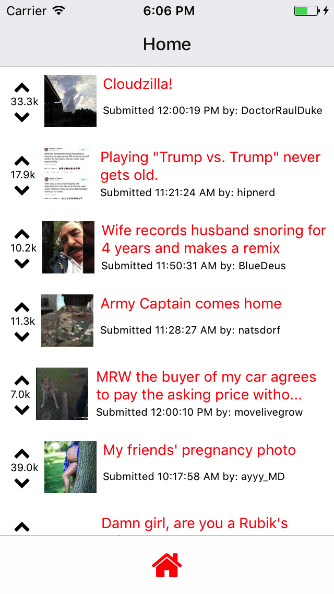

# Reddit Browser

This is a simple app that allows you to easily browse Reddit on your mobile device.

##Running the App

The fastest way to see this app in a mobile device (iOS or Android) is to follow this link:
https://expo.io/@lvamaral/reddit-browser
(You will need to download the expo client)

##Technology

This project was made using React Native with a Redux infrastructure. It fetches data from the Reddit API, stores it locally for faster access, and displays it in a refreshable list. Using exRouter users can click on a post and browse back very efficiently.  

##Process

This app was built as part of a coding challenge. The entire process took around 2-3 days, working a few hours per day.

I set up the initial infrastructure for the app using Expo. Expo gives you a lot of boiler-plate code for free (like the navbar), so it saved a lot of time in getting started. Then I installed and prepared my project for Redux - a massive overkill for such a basic app, but still a good experience. I added the thunk middleware to make it easier to update my app's state with the fetched posts from Reddit asynchronously.

Everything was going great till I reached a devilish little bug (described in some detail here https://github.com/facebook/react-native/issues/4968). For some reason my simulator suddenly couldn't deal with files being imported by other files. I was convinced I had done nothing wrong on my end, so it had to be some issue with React Native or Expo. After hours and hours of Google and soul searching, and trying every possible suggested solution under the sun, it finally worked again. I'm not entirely sure why. Maybe restarting my computer (for the third time) did the trick?

Back on track. I used React Native's Fetch method inside my action creator to tap into Reddit's API, and after fiddling a bit with the format of the returned data got it into a nice array of objects. I made a PostList component which was wrapped with a Container to pass it the getPosts action and my app's state, and a Post presentational component which was used to display each separate post. I also added a RefreshControl in my PostList so that pulling it down triggered a getPosts action again. Finally, I made a check when the ComponentDidMount to see if any local data was available - it it was, I just used that as my state (using another Redux action), and if it wasn't, I called getPosts for the first time and saved the result to local storage.  

Even though the app is quite basic right now, I left some fundamental structure to build on it when I have the time. I think it would be cool to have a search function, and the ability to save liked posts.
